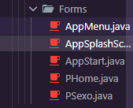
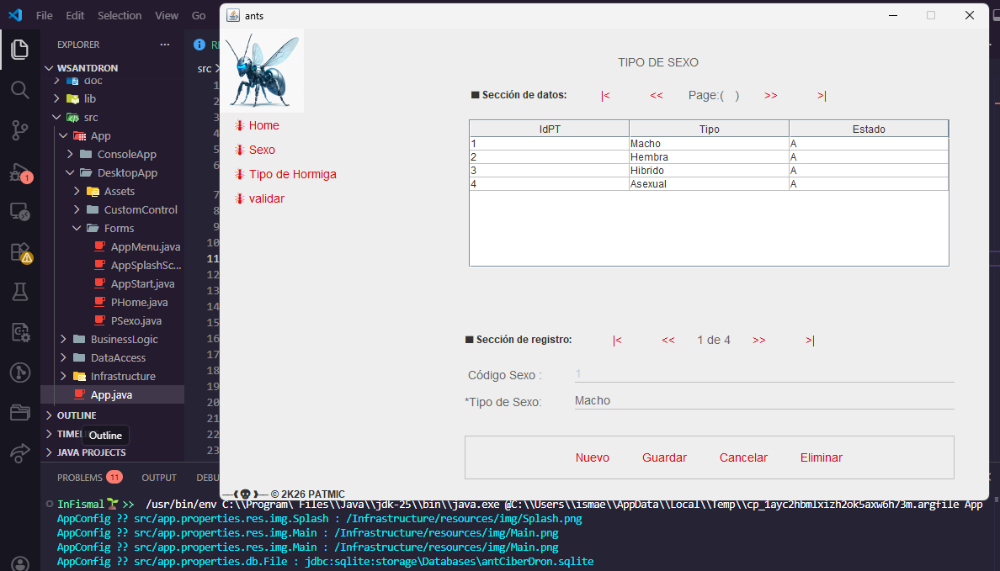
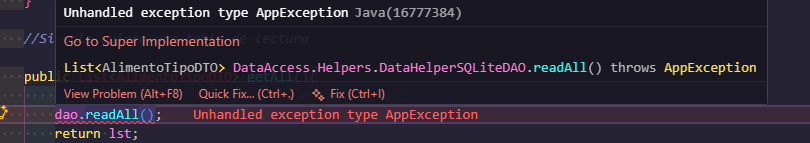

## Uso de Botones

Listener, son escuchadores, escuchan el click, puedo hacerlo de dos formas.

## Comunicación por *lambda*

```java 
btnHormiga.addActionListener(e -> setPanel(new PHome()));

```
Apuntador con lambda, para una forma más elegante de trabajo.
> Genramios un metodo mas abajo para llamarlo

## Comunicación por ...

```java
public class PSexo extends JPanel implements ActionListener {
}
```
Aqui se implmenta al ActionListener, lo que permite que cuando aplaste botones, los lleve todo a este lugar

```java
@Override
    public void actionPerformed(ActionEvent e) {
        if (e.getSource() == btnRowIni)
            regAct = 1;
        if (e.getSource() == btnRowAnt && (regAct > 1))
            regAct--;
        if (e.getSource() == btnRowSig && (regAct < regMax))
            regAct++;
        if (e.getSource() == btnRowFin)
            regAct = regMax;
        try {
            dtoSexo  = blFactory.getBy(regAct);
            showRowData(); 
        } catch (Exception ex) { CMD.printlnError(ex.toString());}
    }
```
- Quiero saber quien ingresa, por tanto pregunta quien ingresa con los if y segun eso, realiza acciones.

> Si existe un error en un solo boton, se los lleva a todos

## Explicacion ventanas



- Cada una de estas clases son las pantallas que existen.

# Preguntas de examen
- Activar o desactivar lo que se ve en consola
- Generar el metodo buscar para grandes registros
- Completar la parte de los layouts.


### Cómo funciona


- Notese que en consola aparecen las propiedades que se van ocupando, como cargar imagenes, o los botones aplastados.

```java
    /************************
    * FormDesing : pat_mic
    ************************/
    int tbAncho = 550, tbAlto = 150;  // tabla de datos
    private PatLabel 
            lblTitulo   = new PatLabel("TIPO DE SEXO"),
            lblIdSexo   = new PatLabel(" Código Sexo :"),
            lblNombre   = new PatLabel("*Tipo de Sexo:"),
            lblTotalReg = new PatLabel(" 0 de 0 ");
    private PatTextBox 
            txtIdSexo   = new PatTextBox(),
            txtNombre   = new PatTextBox();
    private PatButton 
            btnPageIni  = new PatButton(" |< "),
            btnPageAnt  = new PatButton(" << "),
            btnPageSig  = new PatButton(" >> "),
            btnPageFin  = new PatButton(" >| "),

            btnRowIni   = new PatButton(" |< "),
            btnRowAnt   = new PatButton(" << "),
            btnRowSig   = new PatButton(" >> "),
            btnRowFin   = new PatButton(" >| "),

            btnNuevo    = new PatButton("Nuevo"),
            btnGuardar  = new PatButton("Guardar"),
            btnCancelar = new PatButton("Cancelar"),
            btnEliminar = new PatButton("Eliminar");

            private JPanel pnlTabla    = new JPanel();
            private JPanel pnlBtnRow   = new JPanel(new FlowLayout());
            private JPanel pnlBtnPage  = new JPanel(new FlowLayout());
            private JPanel pnlBtnCRUD  = new JPanel(new FlowLayout());
```

Declaro al final de la clase todo lo que voy a utilizar.

--- 

```java

private void initComponents() {
        setLayout(new GridBagLayout());
        GridBagConstraints gbc = new GridBagConstraints();
        
        txtIdSexo.setEnabled(false);
```

Aqui va la parte grafica, el como se va distribuir los espacios y los lugares a utilizar.
> Aqui pides a la IA como quieres que se vea.

---

# Explicacion clase PSexo

```java
public class PSexo extends JPanel implements ActionListener {
    private transient FactoryBL<SexoDTO> blFactory = new FactoryBL<>(SexoDAO.class);
    private transient SexoDTO dtoSexo = new SexoDTO();
    private Integer regAct  = 0;
    private Integer regMax  = 0;

    // Digo hasta donde se pueden mover como maximo por los registros

    public PSexo(){
        try {
            initComponents();
                    
            btnRowIni.addActionListener(this);
            btnRowAnt.addActionListener(this);
            btnRowSig.addActionListener(this);
            btnRowFin.addActionListener(this);

            btnNuevo.addActionListener(     e -> btnNuevoClick      ());
            btnGuardar.addActionListener(   e -> btnGuardarClick    ());
            btnEliminar.addActionListener(  e -> btnEliminarClick   ());
            btnCancelar.addActionListener(  e -> btnCancelarClick   ());


            loadRowData(); //va a la base y trae datos
            showRowData(); // presenta los datos
            showDataTable(); //presenta en la tabla
        }   catch (Exception e) {
            AppMSG.show("Error al cargar los datos tipo de persona: " + e.getMessage());
        }
        // El catch nos sirve para verificar al construir que todo esté funcionando, lo debo quitar cuando ya termina la aplivcacion
    }
```

```java
 private void loadRowData() throws Exception {
        regAct   = blFactory.getMinReg("idSexo");
        regMax   = blFactory.getMaxReg("idSexo");
        dtoSexo  = blFactory.getBy(regAct);
        // pido por medio de factory que me diga cual es el mayor y menor registro, luego, llamo al primero de ellos.
    }
    private void showRowData() { //11:59 en la grabacion
        boolean isDTONull = (dtoSexo == null || dtoSexo.getIdSexo() == null);
        txtIdSexo.setText   ((isDTONull) ? " " : dtoSexo.getIdSexo().toString());
        txtNombre.setText   ((isDTONull) ? " " : dtoSexo.getNombre());
        lblTotalReg.setText (regAct.toString() + " de " + regMax);
    }
    // traigo datos y los presento

    private void showDataTable() throws Exception {
        String[] header = {"IdPT", "Tipo", "Estado"}; //nombres de las columnas de la grilla
        Object[][] data = new Object[regMax][3];
        int index = 0;
        for (SexoDTO  d : blFactory.getAll()) { //traeme todos los registros
            data[index][0] = d.getIdSexo();
            data[index][1] = d.getNombre();
            data[index][2] = d.getEstado();
            index++;    
        }
```

--- 

```java
JTable table = new JTable(data, header); //12:02 en grabacion
        table.setShowHorizontalLines(true);
        table.setRowSelectionAllowed(true);
        table.setGridColor(Color.lightGray);
        table.setColumnSelectionAllowed(false);
        table.setFillsViewportHeight(true);

        pnlTabla.removeAll();
        pnlTabla.setLayout(new BorderLayout()); 
        pnlTabla.add(new JScrollPane(table), BorderLayout.CENTER);

        table.addMouseListener(new MouseAdapter() {
            @Override
            public void mouseClicked(MouseEvent e) {
                int row = table.rowAtPoint(e.getPoint());
                int col = table.columnAtPoint(e.getPoint());
                if (row >= 0 && col >= 0) {
                    String strID = table.getModel().getValueAt(row, 0).toString();
                    regAct = Integer.parseInt(strID);
                    try {
                        dtoSexo = blFactory.getBy(regAct); //cuando hago click, tomo el registro de la Base de Datos y lo muestro, lo refresco
                        showRowData();
                    } catch (Exception _) { 
                        System.out.println("");
                    }
                    System.out.println("Tabla.Selected: " + strID);
                }
            }
        });
    }
```

```java
private void btnNuevoClick() { //12:04
        dtoSexo = null;
        showRowData();
    }
    private void btnGuardarClick() {
        boolean isDTONull = (dtoSexo == null );
        try {
            if (AppMSG.showConfirmYesNo("¿Seguro que desea " + ((isDTONull) ? "AGREGAR ?" : "ACTUALIZAR ?"))) {
                if (isDTONull)  // si el registro es nuevo
                    dtoSexo = new SexoDTO(txtNombre.getText().trim(),"");
                else
                    dtoSexo.setNombre(txtNombre.getText());

                if( !((isDTONull)   ? blFactory.add(dtoSexo) 
                                    : blFactory.upd(dtoSexo))) 
                    throw new Exception("Error al almacenar el registo...");
                
                loadRowData();
                showRowData();
                showDataTable();
            }
        } catch (Exception e) {
            AppMSG.showError( e.getMessage());
        }
    }
```
// 12:09 cambio algo Menu

- Factory me permitió realizar un bypass, pero esto funciona unicamente si 



Cuando me acerco a esta imagen, puedo ver que es lo que retorna

- Crear en combos y cosecha pendiente


